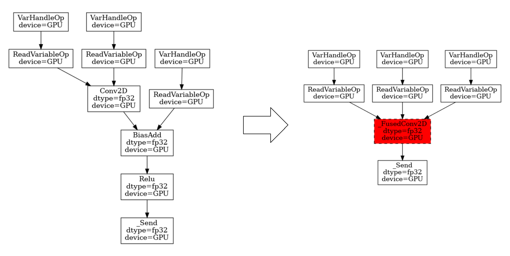
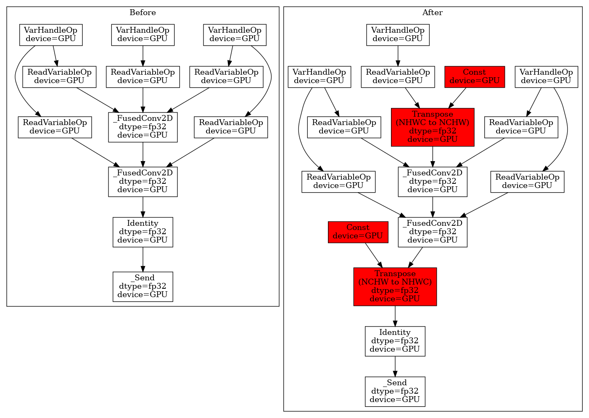
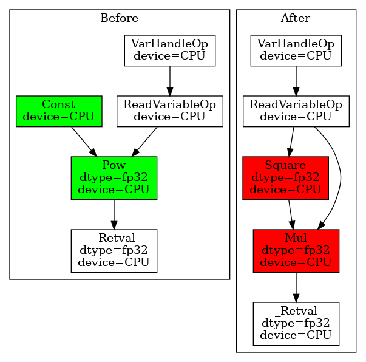

## TF Grappler Optimized Operation Graph

A visualization tool to display TF-Grappler optimized op graph. Grappler is the
default graph optimization system in the TensorFlow runtime. Many different
graph optimization passes will be applied before the actual execution, such as
layout optimization, remapping optimizations, etc. (For the full list of
optimization passes, see
[here](https://www.tensorflow.org/guide/graph_optimization)). The traditional
way to display the op graph is via Tensorboard; however, Tensorboard only shows
the op graph before the grappler passes. To better understand how the grappler
changes the graph, this tool can be used to print out the op graphs before and
after any specified optimization pass.

### Usage
1. Install the dependencies
```bash
pip install pydot && apt update && apt install -y graphviz
```
2. Call the `print_op_graph` function
```python
def sample_model(x):
  w = _weight([k, n])
  b = _weight([n])
  y = tf.linalg.matmul(x, w)
  z = tf.nn.bias_add(y, b)
  out = tf.nn.relu(z)
  return out
 
print_op_graph(sample_model, (m, k), "remapper_pass.png",
               ['remapper'], highlight_patterns=['_Fused'])
```
Then, an image will be generated to show the op graphs before and after the
`remapping` optimization. In addition, the different nodes will be automatically
highlighted in "green" (the nodes only in the left graph) and "red" (the nodes
only in the right graph).

Note, at this point we only support three optimizers: `remapper`, `layout`, and
`arithmetic`.

## Sample
### Remapping OFF & ON
```python
def conv_bias_relu_model(x):
  w = _weight([2, 2, c, c])
  b = _weight([c])

  y = tf.nn.conv2d(x, w, strides=(1, 1), padding='SAME', data_format='NCHW')
  z = tf.nn.bias_add(y, b, data_format='NC..')
  out = tf.nn.relu(z)
  return out

print_op_graph(conv_bias_relu_model, (n, c, h, w), "conv_fusion_pass.png",
               ['remapper'], highlight_patterns=['_Fused'])
```


### Layout Opt OFF & ON
```python
def conv_bias_relu_model(x):
  w = _weight([2, 2, c, c])
  b = _weight([c])

  y = tf.nn.conv2d(x, w, strides=(1, 1), padding='SAME', data_format='NHWC')
  z = tf.nn.bias_add(y, b, data_format='N..C')
  x = tf.nn.relu(z)
  y = tf.nn.conv2d(x, w, strides=(1, 1), padding='SAME', data_format='NHWC')
  z = tf.nn.bias_add(y, b, data_format='N..C')
  out = tf.nn.relu(z)
  return tf.identity(out)

print_op_graph(conv_bias_relu_model, (n, h, w, c), "layout_pass.png",
               ['layout'], highlight_patterns=['Transpose'])
```


### Arithmetic Opt OFF & ON
```python
def pow_model(x):
  x = tf.cast(x, precision)

  out = tf.math.pow(x, 3.0)
  return out

print_op_graph(pow_model, (m, k), "pow_arithmetic_pass.png",
               ['arithmetic'])
```
