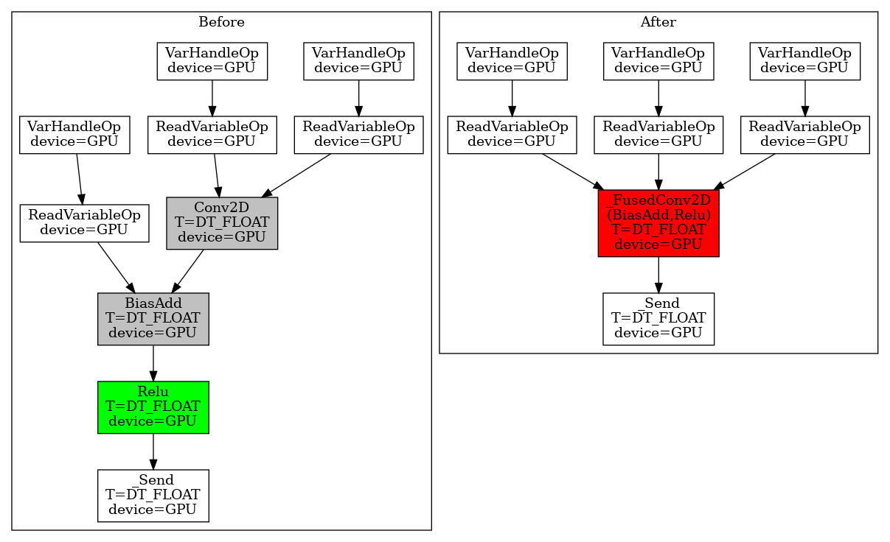
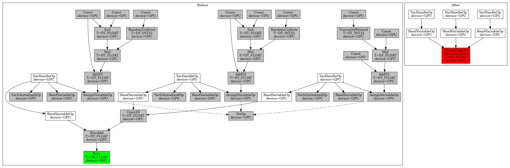

# TF Grappler Optimized Operation Graph

A visualization tool to display TF-Grappler optimized op graph. Grappler is the
default graph optimization system in the TensorFlow runtime. Many different
graph optimization passes will be applied before the actual execution, such as
layout optimization, remapping optimizations, etc. (For the full list of
optimization passes, see
[here](https://www.tensorflow.org/guide/graph_optimization)). The traditional
way to display the op graph is via Tensorboard; however, Tensorboard only shows
the op graph before the grappler passes. To better understand how the grappler
changes the graph, this tool can be used to print out the op graphs before and
after any specified optimization pass.

## Usage
1. Install the dependencies.
```bash
pip install pydot && apt update && apt install -y graphviz
```
2. Clone the project and install it.
```bash
pip install .
```
3. Using the API to plot the op graphs before and after a specified optimizer.
```python
import tf_op_graph_vis
tf_op_graph_vis.grappler_optimized_graph(
    conv_bias_relu_model, (n, c, h, w), "remapper_conv_bias_relu.png",
    ['remapper'])
```
The above example generates the op graphs before and after the `remapping`
optimization. Note, at this point we only support three optimizers: `remapper`,
`layout`, and `arithmetic`. There are many sample codes in [examples](examples).
For example, this sample will generate the following graph.

## Plotted Graphs
In the generated graphs, we conduct a simple graph identity check so that the
nodes getting changed will be highlighted:

* <span style="color:green">GREEN</span>: The nodes appear only in the "before"
  graph. They have the corresponding nodes in the "after" graph with the same
  names but different contents, such as the operation, dtype, etc.
* <span style="color:red">RED</span>: The nodes appear only in the "after"
  graph. They have the corresponding nodes in the "before" graph with the same
  names but different contents, such as the operation, dtype, etc.
* <span style="color:grey">GREY</span>: The nodes get deleted from the "before"
  graph or get added in the "after" graph.

Note: usually the green nodes are transformed to the red nodes. In addition, the
plotted graph supports the control edges (in dashed lines) and port numbers (if
they are not 0s).

## Samples
```bash
python examples/remapper_conv_bias_relu.py
```


Besides, we provide a command-line tool `graphdef2pydot` to support user
generated GraphDef files and visualize (and compare) them:
```bash
graphdef2pydot -g0 pics/first.pb.txt -g1 pics/second.pb.txt -o output.png
```

